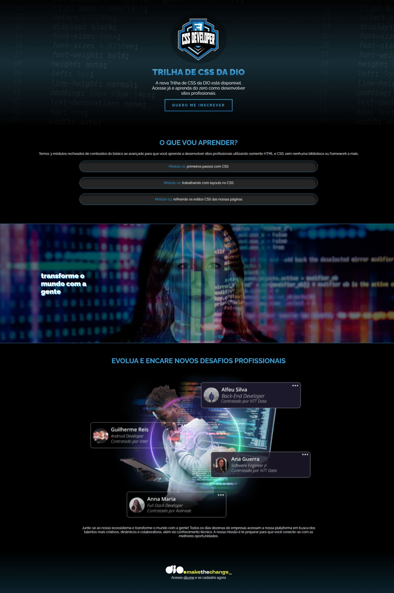

# BootCamp Ifood - Desenvolvimento de jogos

Nesse bootcamp foi possível reforçar meu conhecimento na linguagem **JavaScript**, junto de bases sólidas de **CSS** e também aplicações desses conhecimentos em desenvolvimento de jogos básicos com a possibilidade de ter um entendimento básico sobre como funciona o desenvolvimento de jogos.

## Desafio de projeto

### Desafio CSS Landing Page

O desafio de [Criando sua Primeira Landing Page com HTML e CSS](https://github.com/digitalinnovationone/trilha-css-desafio-01) propõe a criação de uma landing page que dá a possibilidade de colocar em prática oque foi aprendido no curso de HTML e CSS, sendo utilizada várias características doque foi aprendido no decorrer do curso.

O página que foi proposta a criação do desafio tem seu design [nesse link](https://www.figma.com/file/3PiokoJj9IhGDnNiWAJbz7/DIO---Desafio-01?node-id=2%3A6), salvo no Figma, facilitando a criação e sendo mais fácil adquirir o conhecimento sobre a criação da página.

Para tirar um maior proveito doque foi aprendido e daquilo que eu já tinha conhecimento, eu procurei a completar realizar o projeto seguindo o padrão utility first.

> O projeto pode se encontra na pasta [desafio-landing-page](https://github.com/BrunoMedeiros14/CoursesAndChallenges/tree/main/Dio/Ifood_Games/controle-desafio-landing-page/), com sue arquivo de entrada sendo o [desafio-landing-page/index.html](./desafio-landing-page/index.html).

Imagem do projeto finalizado:

---

## Desenvolvido por

')

**[Retornar para página anterior](../README.md)**
<strong> | <a href="#top">Volte para o topo 🔝</a> </strong>

By <strong><a href="https://github.com/BrunoMedeiros14">Bruno Medeiros</a></strong>.

