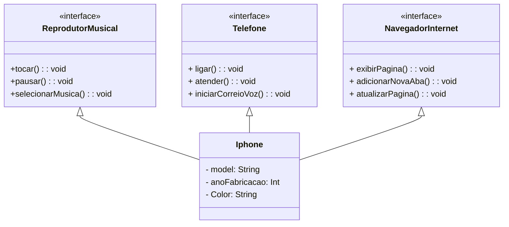

# BootCamp TQI Kotlin

## Java

### Desafio Conta Bancária

O desafio [DIO - Trilha Java Básico](https://github.com/digitalinnovationone/trilha-java-basico/blob/main/desafios/sintaxe/README.md) propõe a criação de um projeto para terminal que lê os dados de criação para uma conta bancária, que solicita a inserção de dados via terminal e logo após apresenta a conta criada.

> O arquivo para a execução deste desafio se encontra na pasta [desafio-basico/src](https://github.com/BrunoMedeiros14/CoursesAndChallenges/tree/main/Dio/Santander_Java/desafio-basico/src/), sendo o arquivo [ContaTerminal](./desafio-basico/src/ContaTerminal.java) aquele que basicamente roda a aplicação.

Como bônus, foi inserido no desafio proposto a inclusão do tratamento de dados inserido no arquivo, para que não seja possível inserir dados de tipos indevidos, como a inserção de uma string no lugar de um double.

---

### Desafio Controle de Fluxo

O desafio de [Controle de Fluxo](https://github.com/digitalinnovationone/trilha-java-basico/tree/main/desafios/controle-fluxo) propõe a criação de um projeto que contém uma validação que após inserir dois inteiros retorna a diferença entre esses números ou lança uma exceção personalizada se o segundo número inserido for maior que o primeiro.

> O arquivo para a execução deste desafio se encontra na pasta [controle-fluxo/src](https://github.com/BrunoMedeiros14/CoursesAndChallenges/tree/main/Dio/Santander_Java/controle-fluxo/src/), sendo o arquivo [Contador](./controle-fluxo/src/Contador.java) aquele que basicamente roda a aplicação.

---

### Desafio POO

Nesse desafio foi proposta uma diagramação em UML do que seria a classe Iphone com interfaces para implementar o **Reprodutor Musicial**, **Aparelho Telefônico** e o **Navegador de Internet**.

> Com base no diagrama, foi criado um exemplo de código em java de como seria sua implementação na pasta [desafio-poo](https://github.com/BrunoMedeiros14/CoursesAndChallenges/tree/main/Dio/TQI_Kotlin/desafio-poo/src/), onde o arquivo principal é o [Iphone.java](./desafio-poo/src/Iphone.java).

---

## Desenvolvido por

')

**[Retornar para página anterior](../README.md)**
<strong> | <a href="#top">Volte para o topo 🔝</a> </strong>

By <strong><a href="https://github.com/BrunoMedeiros14">Bruno Medeiros</a></strong>.

