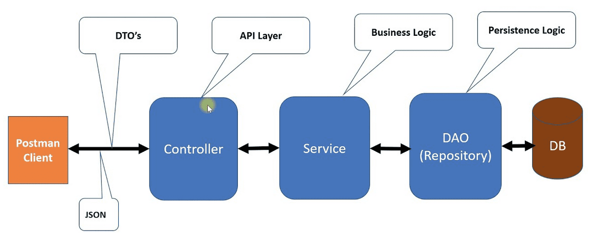

# Sistema de Avaliação de Créditos

Essa API contém a proposta de criar uma aplicação para os funcionários de uma empresa de empréstimos utilizar.

Nesse projeto será utilizado a arquitetura em camadas conforme mostrado na imagem abaixo:

## Stack utilizada

- Spring
- Flyway
- h2
- JPA
- Mockk
